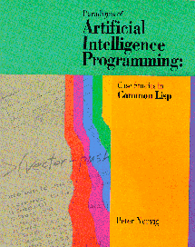

# *Paradigms of Artificial Intelligence Programming (pt-br)* 

## ATENÇÃO!

Esse repositório está em desenvolvimento, algumas partes podem ainda não estarem traduzidas, ou inexistentes comparado
ao repositório oficial em Inglês. 

O seu tradutor [@noloop](https://github.com/noloop) está estudando inglẽs, aproveitou a oportunidade para estudar o livro
e também praticar o inglês ao mesmo tempo, caso perceba algo de errado, não deixe de me alertar abrindo um
[novo problema](https://github.com/noloop/paip-lisp-pt-br/issues), você também pode abrir um problema se deseja ajudar com
este repositório.

Este é um repositório de código aberto é uma versão no português (pt-br) do livro *Paradigms of Artificial
Intelligence Programming: Case Studies in Common Lisp* by Peter Norvig (1992), e o código contido nele. 
Os direitos autorais foram revertidos para o autor, que o compartilhou aqui sob licença do MIT.

Você pode também querer conhecer o repositório do [livro oficial em inglês](https://github.com/norvig/paip-lisp).

## O Livro

O livro também está disponivel nesses formatos:

* pdf: [TODO](TODO.md) 
* text: [TODO](TODO.md) 
* epub: [TODO](TODO.md) 
* e `capitulo?.md` markdown arquivos:

# Índice

- **Paradigms of Artificial Intelligence Programming (pt-br)**
  * [Front matter](docs/frontmatter.md)
  * [Prefácio](docs/prefacio.md)
- **Parte I:  Introdução ao Common Lisp**
  * 1  [Introdução ao Lisp](docs/capitulo1.md)
  * 2  [A Simple Lisp Program](TODO.md)
  * 3 [Overview of Lisp](TODO.md)
- **Part II: Early AI Programs**
  * 4  [GPS:  The General problem Solver](TODO.md)
  * 5  [Eliza:  Dialog with a Machine](TODO.md)
  * 6  [Building Software Tools](TODO.md)
  * 7 [Student:  Solving Algebra Word Problems](TODO.md)
  * 8 [Symbolic Mathematics:  A Simplification Program](TODO.md)
- **Part III:  Tools and Techniques**
  * 9  [Efficiency Issues](TODO.md)
  * 10  [Low-Level Efficiency Issues](TODO.md)
  * 11  [Logic Programming](TODO.md)
  * 12  [Compiling Logic programs](TODO.md)
  * 13  [Object-Oriented Programming](TODO.md)
  * 14  [Knowledge Representation and Reasoning](TODO.md)
- **Part IV:  Advanced AI Programs**
  * 15  [Symbolic Mathematics with Canonical Forms](TODO.md)
  * 16  [Expert Systems](TODO.md)
  * 17  [Line-Diagram Labeling by Constraint Satisfaction](TODO.md)
  * 18  [Search and the Game of Othello](TODO.md)
  * 19  [Introduction to Natural Language](TODO.md)
  * 20  [Unification Grammars](TODO.md)
  * 21  [A Grammar of English](TODO.md)
- **Part V:  The Rest of Lisp**
  * 22  [Scheme:  An Uncommon Lisp](TODO.md)
  * 23  [Compiling Lisp](TODO.md)
  * 24  [ANSI Common Lisp](TODO.md)
  * 25  [Troubleshooting](TODO.md)
  
PAIP Lisp na TV [TV](https://norvig.com/paip-tv.html). Veja também: [errata](https://norvig.com/paip-errata.html), [comentários](https://norvig.com/paip-comments.html), [retrospectiva](https://norvig.com/Lisp-retro.html).

## Arquivos Lisp

Os [arquivos de código Lisp](https://github.com/norvig/paip-lisp/tree/master/lisp) estão listados aqui:

| CP   | Nome do Arquivo                     | Descrição                                                              |
|------|-------------------------------------|------------------------------------------------------------------------|
| -    | [examples.lisp](lisp/examples.lisp) | A list of example inputs taken from the book                           |
| -    | [tutor.lisp](lisp/tutor.lisp)       | An interpreter for running the examples                                |
| -    | [auxfns.lisp](lisp/auxfns.lisp)     | Auxiliary functions; load this before anything else                    |
| 1    | [intro.lisp](lisp/intro.lisp)       | A few simple definitions                                               |
| 2    | [simple.lisp](lisp/simple.lisp)     | Random sentence generator (two versions)                               |
| 3    | [overview.lisp](lisp/overview.lisp) | 14 versions of LENGTH and other examples                               |
| 4    | [gps1.lisp](lisp/gps1.lisp)         | Simple version of General Problem Solver                               |
| 4    | [gps.lisp](lisp/gps.lisp)           | Final version of General Problem Solver                                |
| 5    | [eliza1.lisp](lisp/eliza1.lisp)     | Basic version of Eliza program                                         |
| 5    | [eliza.lisp](lisp/eliza.lisp)       | Eliza with more rules; different reader                                |
| 6    | [patmatch.lisp](lisp/patmatch.lisp) | Pattern Matching Utility                                               |
| 6    | [eliza-pm.lisp](lisp/eliza-pm.lisp) | Version of Eliza using utilities                                       |
| 6    | [search.lisp](lisp/search.lisp)     | Search Utility                                                         |
| 6    | [gps-srch.lisp](lisp/gps-srch.lisp) | Version of GPS using the search utility                                |
| 7    | [student.lisp](lisp/student.lisp)   | The Student Program                                                    |
| 8    | [macsyma.lisp](lisp/macsyma.lisp)   | The Macsyma Program                                                    |
| 8    | [macsymar.lisp](lisp/macsymar.lisp) | Simplification and integration rules for Macsyma                       |
| 9-10 |  &nbsp;                             | (functions from these chapters are in [auxfns.lisp](lisp/auxfns.lisp)) |
| 11   | [unify.lisp](lisp/unify.lisp)       | Unification functions                                                  |
| 11   | [prolog1.lisp](lisp/prolog1.lisp)   | First version of Prolog interpreter                                    |
| 11   | [prolog.lisp](lisp/prolog.lisp)     | Final version of Prolog interpreter                                    |
| 12   | [prologc1.lisp](lisp/prologc1.lisp) | First version of Prolog compiler                                       |
| 12   | [prologc2.lisp](lisp/prologc2.lisp) | Second version of Prolog compiler                                      |
| 12   | [prologc.lisp](lisp/prologc.lisp)   | Final version of Prolog compiler                                       |
| 12   | [prologcp.lisp](lisp/prologcp.lisp) | Primitives for Prolog compiler                                         |
| 13   | [clos.lisp](lisp/clos.lisp)         | Some object-oriented and CLOS code                                     |
| 14   | [krep1.lisp](lisp/krep1.lisp)       | Knowledge Representation code: first version                           |
| 14   | [krep2.lisp](lisp/krep2.lisp)       | Knowledge Representation code with conjunctions                        |
| 14   | [krep.lisp](lisp/krep.lisp)         | Final KR code: worlds and attached functions                           |
| 15   | [cmacsyma.lisp](lisp/cmacsyma.lisp) | Efficient Macsyma with canonical form                                  |
| 16   | [mycin.lisp](lisp/mycin.lisp)       | The Emycin expert system shell                                         |
| 16   | [mycin-r.lisp](lisp/mycin-r.lisp)   | Some rules for a medical application of emycin                         |
| 17   | [waltz.lisp](lisp/waltz.lisp)       | A Line-Labeling program using the Waltz algorithm                      |
| 18   | [othello.lisp](lisp/othello.lisp)   | The Othello playing program and some strategies                        |
| 18   | [othello2.lisp](lisp/othello2.lisp) | Additional strategies for Othello                                      |
| 18   | [edge-tab.lisp](lisp/edge-tab.lisp) | Edge table for Iago strategy                                           |
| 19   | [syntax1.lisp](lisp/syntax1.lisp)   | Syntactic Parser                                                       |
| 19   | [syntax2.lisp](lisp/syntax2.lisp)   | Syntactic Parser with semantics                                        |
| 19   | [syntax3.lisp](lisp/syntax3.lisp)   | Syntactic Parser with semantics and preferences                        |
| 20   | [unifgram.lisp](lisp/unifgram.lisp) | Unification Parser                                                     |
| 21   | [grammar.lisp](lisp/grammar.lisp)   | Comprehensive grammar of English                                       |
| 21   | [lexicon.lisp](lisp/lexicon.lisp)   | Sample Lexicon of English                                              |
| 22   | [interp1.lisp](lisp/interp1.lisp)   | Scheme interpreter, including version with macros                      |
| 22   | [interp2.lisp](lisp/interp2.lisp)   | A tail recursive Scheme interpreter                                    |
| 22   | [interp3.lisp](lisp/interp3.lisp)   | A Scheme interpreter that handles call/cc                              |
| 23   | [compile1.lisp](lisp/compile1.lisp) | Simple Scheme compiler                                                 |
| 23   | [compile2.lisp](lisp/compile2.lisp) | Compiler with tail recursion and primitives                            |
| 23   | [compile3.lisp](lisp/compile3.lisp) | Compiler with peephole optimizer                                       |
| 23   | [compopt.lisp](lisp/compopt.lisp)   | Peephole optimizers for compile3.lisp                                  |

# Executando o Código

Não existe um "aplicativo" único para executar. Em vez disso, há uma coleção de arquivos de código fonte,
duplicando o código do livro. Você pode ler e/ou executar o que quiser. Lisp é uma linguagem interativa,
e você precisará de interagir com o código para se beneficiar dele. Algumas dicas:

* Você precisará de um interpretador/compilador/ambiente Common Lisp. Aqui está uma 
[discussão em inglês](https://www.reddit.com/r/lisp/comments/752wxe/what_is_the_best_common_lisp_interpreter_out_there/) das opções.
* Você sempre precisará do `(load "auxfns.lisp")`.
* Você precisará de `(requires "`*arquivo*`")`, para as várias
instâncias dos *arquivo* que você deseja usar. (Se `requires` não funcionar corretamente,
você pode querer alterar sua definição em `auxfns.lisp`.  
* A função `do-examples`, que aceita como argumento `:all`
ou um número de capítulo ou uma lista de números de capítulos, pode ser usada para ver exemplos
do uso de várias funções. Por exemplo, `(do-examples 1)` mostra
os exemplos do capítulo 1. Acesse isso fazendo `(requires "examples")`.

# Outros recursos

* Há uma boa [versão Python](https://github.com/dhconnelly/paip-python) do código, por Georgia Tech.