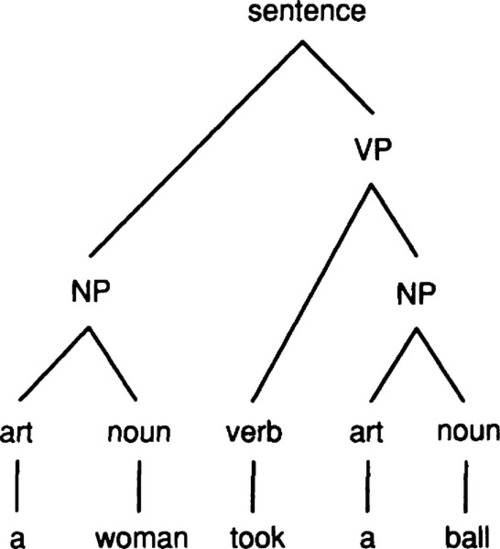

# Capítulo 2
## Um simples programa em Lisp

> *Certum quod factum.*

> (Só se sabe ao certo o que se constrói.)

> -Giovanni Battista Vico (1668-1744)

> Historiografista real italiano

Você nunca irá torna-se proficiente em uma linguagem estrangeira estudando listas de vocabulários.
Em vez disso, você deve escutar e falar (ou ler e escrever) a linguagem para ganhar proficiência.
O mesmo vale para o aprendizado de linguagens de computador.

Esse capítulo mostra como combinar as funções básicas e formulários especiais do Lisp em um programa completo.
Se você aprender como fazer isso, será fácil adquirir o vocabulário restante do Lisp (como descrito no capítulo 3).

## 2.1 Gramática para um subconjunto de inglês

O programa que desenvolveremos neste capítulo gera sentenças aleatórias em inglês.
Aqui está uma gramática simples para uma pequena parte do inglês:

> *Sentence* => *Noun-Phrase + Verb-Phrase*  
> *Noun-Phrase* => *Article + Noun*  
> *Verb-Phrase* => *Verb + Noun-Phrase*  
> *Article* => *the, a,...*  
> *Noun* => *man, ball, woman, table...*  
> *Verb* => *hit, took, saw, liked...*  

Tradução livre das palavras acima:

* **Sentence** = Sentença
* **Noun-Phrase** = Frase substantiva
* **Verb-Phrase** = Frase verbal
* **Article** = Artigo
* **Noun** = Substantivo
* **Verb** = Verbo
* **the** = a/o/as/os
* **a** = um/uma
* **man, ball, woman, table** = homem, bola, mulher, mesa
* **hit, took, saw, liked** = acertar, pegou, viu, gostou

Para ser técnico, esta descrição é chamada de "gramática de estrutura de frase sem contexto", e o paradigma subjacente é
chamado "sintaxe generativa".
A ideia é que onde quer que desejamos uma sentença, nós podemos gerar uma frase substantiva seguida por uma frase verbal.
Onde quer que uma frase substantiva tenha sido especificada, geramos um artigo seguido por um substantivo.
Onde quer que um artigo tenha sido especificado, nós geramos "the", "a", ou qualquer outro artigo.
O formalismo é "livre de contexto" porque as regras se aplicam em qualquer lugar, independente das palavras ao redor, e a abordagem é "generativa"
porque as regras como um todo definem o conjunto completo de sentenças em um idioma (e por contraste o conjunto de não sentenças também).
A seguir, mostramos a derivação de uma única frase usando as regras:

* Para obter uma *Sentença*, acrescente uma *Frase substantiva* e uma *Frase verbal*
  * Para obter uma *Frase substantiva*, adicione um *Artigo* e um *Substantivo*
    * Escolha *"the"* para o *Artigo*
	* Escolha *"man"* para o *Substantivo*
  * A *Frase substantiva* resultante é *"the man"*
  * Para obter uma *Frase verbal*, acrescente um *Verbo* e uma *Frase substantiva*
    * Escolha *"hit"* para o *Verbo*
    * Para obter uma *Frase substantiva*, adicione um *Artigo* e um *Substantivo*
      * Escolha *"the"* para o *Artigo*
      * Escolha *"ball"* para o *Substantivo*
    * A *Frase substantiva* resultante é *"the ball"*
  * A *Frase verbal* resultante é *"hit the ball"*
* A *Sentença* resultante é *"The man hit the ball"*

## 2.2 Uma solução direta

Nós desenvolveremos um programa que gera sentenças aleatórias a partir de uma gramática de estrutura de frases.
A abordagem mais direta é representar cada regra gramatical por uma função em Lisp separada:

```lisp
(defun sentence ()    (append (noun-phrase) (verb-phrase)))
(defun noun-phrase () (append (Article) (Noun)))
(defun verb-phrase () (append (Verb) (noun-phrase)))
(defun Article ()     (one-of '(the a)))
(defun Noun ()        (one-of '(man ball woman table)))
(defun Verb ()        (one-of '(hit took saw liked)))
```
Cada uma das definições de funções possui uma lista de parâmetros vazia, `()`.
Isso significa que as funções não aceitam argumentos.
Isso é incomum, porque, estritamente falando, uma função sem argumentos sempre retornaria a mesma coisa, portanto seria
melhor o uso de uma constante.
Contudo, essas funções usam a função `random` (como veremos em breve), e assim podem retornar resultados diferentes 
mesmo sem argumentos.
Entretanto, elas não são funções no sentindo matemático, mas elas ainda são chamadas de funções no Lisp, porque retornam
um valor.

Tudo o que resta agora é definir a função `one-of`.
Ela aceita uma lista de opções possíveis como argumento, escolhe uma delas aleatoriamente e retorna uma lista com o elemento escolhido.
Essa última parte é para que todas as funções da gramática retornem uma lista de palavras.
Dessa maneira, nós podemos aplicar livremente `append` a qualquer categoria. 

```lisp
(defun one-of (set)
  "Pick one element of set, and make a list of it.
   pt-br: Escolhe um elemento do conjunto, e constrói uma lista com o mesmo."
  (list (random-elt set)))

(defun random-elt (choices)
  "Choose an element from a list at random.
   pt-br: Escolhe um elemnto da lista em aleatório."
  (elt choices (random (length choices))))
```

Há duas novas funções aqui, `elt` e `random`.
`elt` escolhe e retorna um elemento de uma lista.
O primeiro argumento é a lista, e o segundo é a posição na lista.
A parte confusa é que as posições começam em 0, então `(elt choices 0)` é o primeiro elemento da lista, 
e `(elt choices 1)` é o segundo.
Pense no número da posição como sendo sempre o próximo elemento da lista, então partindo do zero, 
o zero é o primeiro elemento da lista, o um o segundo, o dois o terceiro, e assim por diante.
A expressão `(random n)` retorna um número inteiro de 0 a n-1, então `(random 4)` deve retornar 0, 1, 2, ou 3.

Agora podemos testar o programa gerando algumas sentenças aleatórias, juntamente com uma frase substantiva e uma frase verbal:

```lisp
> (sentence) => (THE WOMAN HIT THE BALL)

> (sentence) => (THE WOMAN HIT THE MAN)

> (sentence) =>(THE BALL SAW THE WOMAN)

> (sentence) => (THE BALL SAW THE TABLE)

> (noun-phrase) => (THE MAN)

> (verb-phrase) => (LIKED THE WOMAN)

> (trace sentence noun-phrase verb-phrase article noun verb) =>
(SENTENCE NOUN-PHRASE VERB-PHRASE ARTICLE NOUN VERB)

> (sentence) =>
(1 ENTER SENTENCE)
  (1 ENTER NOUN-PHRASE)
    (1 ENTER ARTICLE)
    (1 EXIT ARTICLE: (THE))
    (1 ENTER NOUN)
    (1 EXIT NOUN: (MAN))
  (1 EXIT NOUN-PHRASE: (THE MAN))
  (1 ENTER VERB-PHRASE)
    (1 ENTER VERB)
    (1 EXIT VERB: (HIT))
    (1 ENTER NOUN-PHRASE)
      (1 ENTER ARTICLE)
      (1 EXIT ARTICLE: (THE))
      (1 ENTER NOUN)
      (1 EXIT NOUN: (BALL))
    (1 EXIT NOUN-PHRASE: (THE BALL))
  (1 EXIT VERB-PHRASE: (HIT THE BALL))
(1 EXIT SENTENCE: (THE MAN HIT THE BALL))
(THE MAN HIT THE BALL)
```

O programa funciona bem e o rastreamento se parece exatamente como a derivação mostrada anteriormente, mas as definições do Lisp 
são um pouco mais difíceis de ler do que as regras gramaticais originais.
Esse problema será agravado à medida que considerarmos regras mais complexas.
Suponha que desejássemos permitir que as frases substantivas fossem modificadas por um número indefinido de adjetivos e um
número indefinido de frases preposicionais.
Na notação gramatical, podemos ter as seguintes regras:

> *Noun-Phrase => Article + Adj\* + Noun + PP\*  
> Adj\* => 0&#x0338;, Adj + Adj\*  
> PP\* => 0&#x0338;, PP + PP\*  
> PP => Prep + Noun-Phrase  
> Adj => big, little, blue, green, ...  
> Prep => to, in, by, with, ...*

Nessa notação, 0&#x0338; indica a escolha de nada, a vírgula indica a escolha de várias alternativas, e o asterisco não
é nada em especial no Lisp, é apenas parte do nome do símbolo.
No entanto, a convenção usada aqui é que nomes que terminam com um asterisco indicam zero ou mais repetições do nome
subjacente.
Isso é, *PP\** indica zero ou mais repetições de *PP*.
<a id="tfn02-1"></a>
Isso é conhecido como notação "Kleene star" (pronuncia-se "clean-E"), "Kleene" por conta do matemático Stephen Cole Kleene.

O problema é que as regras para *Adj\** e *PP\** contém opções que deveríamos representar como algum tipo de
condicional no Lisp. Por exemplo:

```lisp
(defun Adj* ()
  (if (= (random 2) 0)
      nil
      (append (Adj) (Adj*))))

(defun PP* ()
  (if (random-elt '(t nil))
      (append (PP) (PP*))
      nil))

(defun noun-phrase () (append (Article) (Adj*) (Noun) (PP*)))
(defun PP () (append (Prep) (noun-phrase)))
(defun Adj () (one-of '(big little blue green adiabatic)))
(defun Prep () (one-of '(to in by with on)))
```

Eu escolhi duas implementações diferentes para `Adj*` e `PP*`; qualquer abordagem funcionaria em qualquer função.
No entanto, temos que ter cuidado; aqui estão duas abordagens que não funcionariam:

```lisp
(defun Adj* ()
  "Warning - incorrect definition of Adjectives.
   pt-br: Aviso - definição incorreta de adjetivos."
  (one-of '(nil (append (Adj) (Adj*)))))
(defun Adj* ()
  "Warning - incorrect definition of Adjectives.
   pt-br: Aviso - definição incorreta de adjetivos."
  (one-of (list nil (append (Adj) (Adj*)))))
```

A primeira definição é errada porque retornaria a expressão literal 
`((append (Adj) (Adj*)))` enquanto o esperado é uma lista de palavras.
A segunda definição causaria uma recursão infinita, porque computando o valor de 
`(Adj*)` sempre envolve uma chamada recursiva para `(Adj*)`. 
O ponto é que o que começou como funções simples agora está se tornando bastante complexo.
Pra entendê-las, precisamos de saber muitas convenções do Lisp como: 
`defun, (), case, if`, `quote`, e as regras para a ordem da avaliação, 
quando, idealmente, a implementação de uma regra gramatical deve usar apenas 
convenções *linguísticas*.
Se quiséssemos desenvolver uma gramática maior, o problema poderia piorar, porque o 
escritor de regras pode precisar depender cada vez mais do Lisp.

## 2.3 A Rule-Based Solution

An alternative implementation of this program would concentrate on making it easy to write grammar rules and would worry later about how they will be processed.
Let's look again at the original grammar rules:

> *Sentence => Noun-Phrase + Verb-Phrase  
> Noun-Phrase => Article + Noun  
> Verb-Phrase => Verb + Noun-Phrase  
> Article => the, a, ...  
> Noun => man, ball, woman, table...  
> Verb => hit, took, saw, liked...*

Each rule consists of an arrow with a symbol on the left-hand side and something on the right-hand side.
The complication is that there can be two kinds of right-hand sides: a concatenated list of symbols, as in "*Noun-Phrase => Article+Noun*," or a list of alternate words, as in "*Noun => man, ball, ...*"
We can account for these possibilities by deciding that every rule will have a list of possibilities on the right-hand side, and that a concatenated list, *for example "Article+Noun,"* will be represented as a Lisp list, *for example* "(`Article Noun`)".
The list of rules can then be represented as follows:

```lisp
(defparameter *simple-grammar*
  '((sentence -> (noun-phrase verb-phrase))
    (noun-phrase -> (Article Noun))
    (verb-phrase -> (Verb noun-phrase))
    (Article -> the a)
    (Noun -> man ball woman table)
    (Verb -> hit took saw liked))
  "A grammar for a trivial subset of English.")

(defvar *grammar* *simple-grammar*
  "The grammar used by generate.  Initially, this is
  *simple-grammar*, but we can switch to other grammars.")
```

Note that the Lisp version of the rules closely mimics the original version.
In particular, I include the symbol "->", even though it serves no real purpose; it is purely decorative.

The special forms `defvar` and `defparameter` both introduce special variables and assign a value to them; the difference is that a *variable*, like `*grammar*,` is routinely changed during the course of running the program.
A *parameter*, like `*simple-grammar*`, on the other hand, will normally stay constant.
A change to a parameter is considered a change *to* the program, not a change *by* the program.

Once the list of rules has been defined, it can be used to find the possible rewrites of a given category symbol.
The function `assoc` is designed for just this sort of task.
It takes two arguments, a "key" and a list of lists, and returns the first element of the list of lists that starts with the key.
If there is none, it returns `nil`.
Here is an example:

```lisp
> (assoc 'noun *grammar*) => (NOUN -> MAN BALL WOMAN TABLE)
```

Although rules are quite simply implemented as lists, it is a good idea to impose a layer of abstraction by defining functions to operate on the rules.
We will need three functions: one to get the right-hand side of a rule, one for the left-hand side, and one to look up all the possible rewrites (right-hand sides) for a category.

```lisp
(defun rule-lhs (rule)
  "The left hand side of a rule."
  (first rule))

(defun rule-rhs (rule)
  "The right hand side of a rule."
  (rest (rest rule)))

(defun rewrites (category)
  "Return a list of the possible rewrites for this category."
  (rule-rhs (assoc category *grammar*)))
```

Defining these functions will make it easier to read the programs that use them, and it also makes changing the representation of rules easier, should we ever decide to do so.

We are now ready to address the main problem: defining a function that will generate sentences (or noun phrases, or any other category).
We will call this function `generate`.
It will have to contend with three cases:
(1) In the simplest case, `generate` is passed a symbol that has a set of rewrite rules associated with it.
We choose one of those at random, and then generate from that.
(2) If the symbol has no possible rewrite rules, it must be a terminal symbol-a word, rather than a grammatical category-and we want to leave it alone.
Actually, we return the list of the input word, because, as in the previous program, we want all results to be lists of words.
(3) In some cases, when the symbol has rewrites, we will pick one that is a list of symbols, and try to generate from that.
Thus, `generate` must also accept a list as input, in which case it should generate each element of the list, and then append them all together.
In the following, the first clause in `generate` handles this case, while the second clause handles (1) and the third handles (2).
Note that we used the `mappend` function from section 1.7 (page 18).

```lisp
(defun generate (phrase)
  "Generate a random sentence or phrase"
  (cond ((listp phrase)
         (mappend #'generate phrase))
        ((rewrites phrase)
         (generate (random-elt (rewrites phrase))))
        (t (list phrase))))
```

Like many of the programs in this book, this function is short, but dense with information: the craft of programming includes knowing what *not* to write, as well as what to write.

This style of programming is called *data-driven* programming, because the data (the list of rewrites associated with a category) drives what the program does next.
It is a natural and easy-to-use style in Lisp, leading to concise and extensible programs, because it is always possible to add a new piece of data with a new association without having to modify the original program.

Here are some examples of `generate` in use:

```lisp
> (generate 'sentence) => (THE TABLE SAW THE BALL)

> (generate 'sentence) => (THE WOMAN HIT A TABLE)

> (generate 'noun-phrase) => (THE MAN)

> (generate 'verb-phrase) (TOOK A TABLE)
```

There are many possible ways to write `generate`.
The following version uses `if` instead of `cond`:

```lisp
(defun generate (phrase)
  "Generate a random sentence or phrase"
  (if (listp phrase)
      (mappend #'generate phrase)
      (let ((choices (rewrites phrase)))
        (if (null choices)
            (list phrase)
            (generate (random-elt choices))))))
```

This version uses the special form `let`, which introduces a new variable (in this case, `choices`) and also binds the variable to a value.
In this case, introducing the variable saves us from calling the function `rewrites` twice, as was done in the `cond` version of `generate`.
The general form of a `let` form is:

```lisp
    `(let` ((*var value*)...)
        *body-containing-vars*)
```

`let` is the most common way of introducing variables that are not parameters of functions.
One must resist the temptation to use a variable without introducing it:

```lisp
(defun generate (phrase)
  (setf choices ...)         ;; wrong!
  ... choices ...)
```
This is wrong because the symbol `choices` now refers to a special or global variable, one that may be shared or changed by other functions.
Thus, the function `generate` is not reliable, because there is no guarantee that `choices` will retain the same value from the time it is set to the time it is referenced again.
With `let` we introduce a brand new variable that nobody else can access; therefore it is guaranteed to maintain the proper value.

&#9635; **Exercise  2.1 [m]** Write a version of `generate` that uses `cond` but avoids calling `rewrites` twice.

&#9635; **Exercise  2.2 [m]** Write a version of `generate` that explicitly differentiates between terminal symbols (those with no rewrite rules) and nonterminal symbols.

## 2.4 Two Paths to Follow

The two versions of the preceding program represent two alternate approaches that come up time and time again in developing programs: (1) Use the most straightforward mapping of the problem description directly into Lisp code.
(2) Use the most natural notation available to solve the problem, and then worry about writing an interpreter for that notation.

Approach (2) involves an extra step, and thus is more work for small problems.
However, programs that use this approach are often easier to modify and expand.
This is especially true in a domain where there is a lot of data to account for.
The grammar of natural language is one such domain-in fact, most AI problems fit this description.
The idea behind approach (2) is to work with the problem as much as possible in its own terms, and to minimize the part of the solution that is written directly in Lisp.

Fortunately, it is very easy in Lisp to design new notations-in effect, new programming languages.
Thus, Lisp encourages the construction of more robust programs.
Throughout this book, we will be aware of the two approaches.
The reader may notice that in most cases, we choose the second.

## 2.5 Changing the Grammar without Changing the Program

We show the utility of approach (2) by defining a new grammar that includes adjectives, prepositional phrases, proper names, and pronouns.
We can then apply the `generate` function without modification to this new grammar.

```lisp
(defparameter *bigger-grammar*
  '((sentence -> (noun-phrase verb-phrase))
    (noun-phrase -> (Article Adj* Noun PP*) (Name) (Pronoun))
    (verb-phrase -> (Verb noun-phrase PP*))
    (PP* -> () (PP PP*))
    (Adj* -> () (Adj Adj*))
    (PP -> (Prep noun-phrase))
    (Prep -> to in by with on)
    (Adj -> big little blue green adiabatic)
    (Article -> the a)
    (Name -> Pat Kim Lee Terry Robin)
    (Noun -> man ball woman table)
    (Verb -> hit took saw liked)
    (Pronoun -> he she it these those that)))

(setf *grammar* *bigger-grammar*)

> (generate 'sentence)
(A TABLE ON A TABLE IN THE BLUE ADIABATIC MAN SAW ROBIN
 WITH A LITTLE WOMAN)

> (generate 'sentence)
(TERRY SAW A ADIABATIC TABLE ON THE GREEN BALL BY THAT WITH KIM
 IN THESE BY A GREEN WOMAN BY A LITTLE ADIABATIC TABLE IN ROBIN
 ON LEE)

> (generate 'sentence)
(THE GREEN TABLE HIT IT WITH HE)
```

Notice the problem with case agreement for pronouns: the program generated "with he," although "with him" is the proper grammatical form.
Also, it is clear that the program does not distinguish sensible from silly output.

## 2.6 Using the Same Data for Several Programs

Another advantage of representing information in a declarative form-as rules or facts rather than as Lisp functions-is that it can be easier to use the information for multiple purposes.
Suppose we wanted a function that would generate not just the list of words in a sentence but a representation of the complete syntax of a sentence.
For example, instead of the list `(a woman took a ball)`, we want to get the nested list:

```lisp
(SENTENCE (NOUN-PHRASE (ARTICLE A) (NOUN WOMAN))
          (VERB-PHRASE (VERB TOOK)
                       (NOUN-PHRASE (ARTICLE A) (NOUN BALL))))
```

This corresponds to the tree that linguists draw as in figure 2.1.


**Figure 2.1: Sentence Parse Tree**

Using the "straightforward functions" approach we would be stuck; we'd have to rewrite every function to generate the additional structure.
With the "new notation" approach we could keep the grammar as it is and just write one new function: a version of `generate` that produces nested lists.
The two changes are to `cons` the category onto the front of each rewrite, and then not to `append` together the results but rather just list them with `mapcar`:

```lisp
(defun generate-tree (phrase)
  "Generate a random sentence or phrase,
  with a complete parse tree."
  (cond ((listp phrase)
         (mapcar #'generate-tree phrase))
        ((rewrites phrase)
         (cons phrase
               (generate-tree (random-elt (rewrites phrase)))))
        (t (list phrase))))
```

Here are some examples:

```lisp
> (generate-tree 'Sentence)
(SENTENCE (NOUN-PHRASE (ARTICLE A)
                       (ADJ*)
                       (NOUN WOMAN)
                       (PP*))
      (VERB-PHRASE (VERB HIT)
                       (NOUN-PHRASE (PRONOUN HE))
                       (PP*)))

> (generate-tree 'Sentence)
(SENTENCE (NOUN-PHRASE (ARTICLE A)
                       (NOUN WOMAN))
          (VERB-PHRASE (VERB TOOK)
                       (NOUN-PHRASE (ARTICLE A) (NOUN BALL))))
```

As another example of the one-data/multiple-program approach, we can develop a function to generate all possible rewrites of a phrase.
The function `generate-all` returns a list of phrases rather than just one, and we define an auxiliary function, `combine-all`, to manage the combination of results.
Also, there are four cases instead of three, because we have to check for nil explicitly.
Still, the complete program is quite simple:

```lisp
(defun generate-all (phrase)
  "Generate a list of all possible expansions of this phrase."
  (cond ((null phrase) (list nil))
        ((listp phrase)
         (combine-all (generate-all (first phrase))
                      (generate-all (rest phrase))))
        ((rewrites phrase)
         (mappend #'generate-all (rewrites phrase)))
        (t (list (list phrase)))))

(defun combine-all (xlist ylist)
  "Return a list of lists formed by appending a y to an x.
  E.g., (combine-all '((a) (b)) '((1) (2)))
  -> ((A 1) (B 1) (A 2) (B 2))."
  (mappend #'(lambda (y)
               (mapcar #'(lambda (x) (append x y)) xlist))
           ylist))
```

We can now use `generate-all` to test our original little grammar.
Note that a serious drawback of `generate-all` is that it can't deal with recursive grammar rules like 'Adj\* => Adj + Adj\*' that appear in `*bigger-grammar*,` since these lead to an infinite number of outputs.
But it works fine for finite languages, like the language generated by `*simple-grammar*`:

```lisp
> (generate-all 'Article)

((THE) (A))

> (generate-all 'Noun)

((MAN) (BALL) (WOMAN) (TABLE))

> (generate-all 'noun-phrase)
((A MAN) (A BALL) (A WOMAN) (A TABLE)
 (THE MAN) (THE BALL) (THE WOMAN) (THE TABLE))

> (length (generate-all 'sentence))
256
```

There are 256 sentences because every sentence in this language has the form Article-Noun-Verb-Article-Noun, and there are two articles, four nouns and four verbs (2 x 4 x 4 x 2 x 4 = 256).

## 2.7 Exercises

&#9635; **Exercise  2.3 [h]** Write a trivial grammar for some other language.
This can be a natural language other than English, or perhaps a subset of a computer language.

&#9635; **Exercise  2.4 [m]** One way of describing `combine-all` is that it calculates the cross-product of the function `append` on the argument lists.
Write the higher-order function `cross-product`, and define `combine-all` in terms of it.

The moral is to make your code as general as possible, because you never know what you may want to do with it next.

## 2.8 Answers

### Answer 2.1

```lisp
  (defun generate (phrase)
  "Generate a random sentence or phrase"
  (let ((choices nil))
    (cond ((listp phrase)
        (mappend #'generate phrase))
       ((setf choices (rewrites phrase))
        (generate (random-elt choices)))
       (t (list phrase)))))
```

### Answer 2.2

```lisp
(defun generate (phrase)
  "Generate a random sentence or phrase"
  (cond ((listp phrase)
         (mappend #'generate phrase))
        ((non-terminal-p phrase)
         (generate (random-elt (rewrites phrase))))
        (t (list phrase))))

(defun non-terminal-p (category)
  "True if this is a category in the grammar."
  (not (null (rewrites category))))
```

### Answer 2.4

```lisp
(defun cross-product (fn xlist ylist)
  "Return a list of all (fn x y) values."
  (mappend #'(lambda (y)
               (mapcar #'(lambda (x) (funcall fn x y))
                       xlist))
           ylist))

(defun combine-all (xlist ylist)
  "Return a list of lists formed by appending a y to an x"
  (cross-product #'append xlist ylist))
```

Now we can use the `cross-product` in other ways as well:

```
> (cross-product #'+ '(1 2 3) '(10 20 30))
(11 12 13
 21 22 23
 31 32 33)

> (cross-product #'list '(a b c d e f g h)
                        '(1 2 3 4 5 6 7 8))
((A 1) (B 1) (C 1) (D 1) (E 1) (F 1) (G 1) (H 1)
 (A 2) (B 2) (C 2) (D 2) (E 2) (F 2) (G 2) (H 2)
 (A 3) (B 3) (C 3) (D 3) (E 3) (F 3) (G 3) (H 3)
 (A 4) (B 4) (C 4) (D 4) (E 4) (F 4) (G 4) (H 4)
 (A 5) (B 5) (C 5) (D 5) (E 5) (F 5) (G 5) (H 5)
 (A 6) (B 6) (C 6) (D 6) (E 6) (F 6) (G 6) (H 6)
 (A 7) (B 7) (C 7) (D 7) (E 7) (F 7) (G 7) (H 7)
 (A 8) (B 8) (C 8) (D 8) (E 8) (F 8) (G 8) (H 8))
```

----------------------
<a id="fn02-1"></a>
[1](#tfn02-1) Em breve, veremos a notação "Kleene plus", em que *PP+* indica uma ou mais repetições de *PP*.
